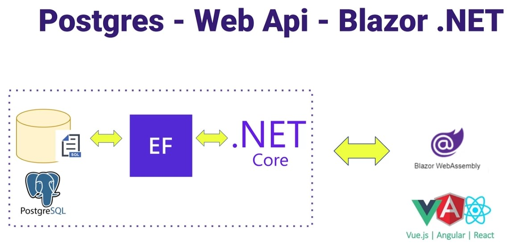
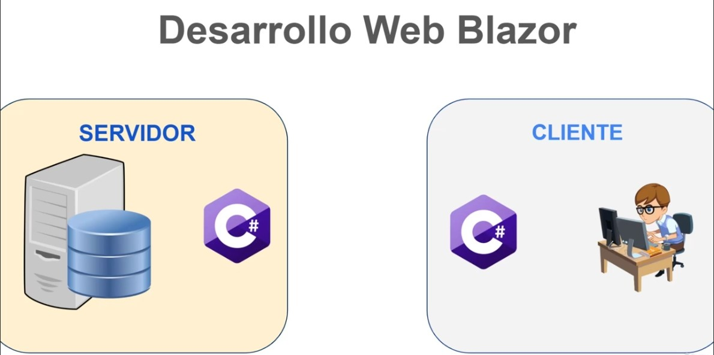
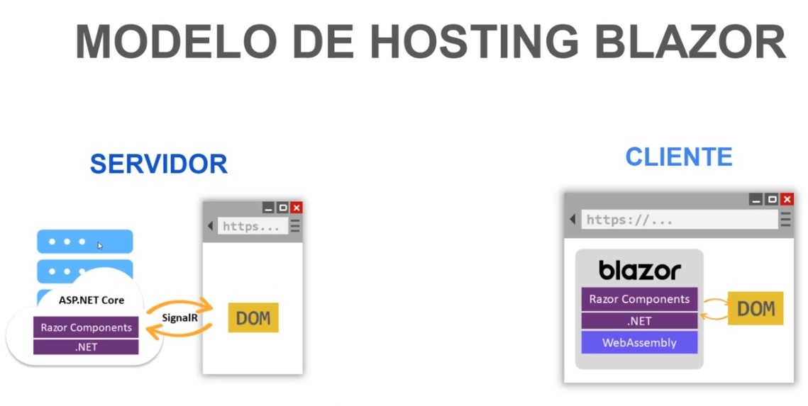
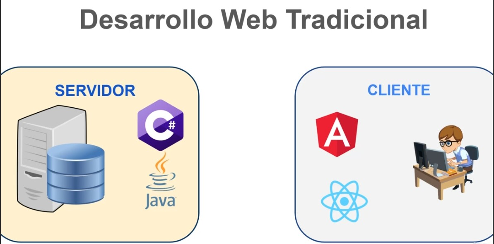
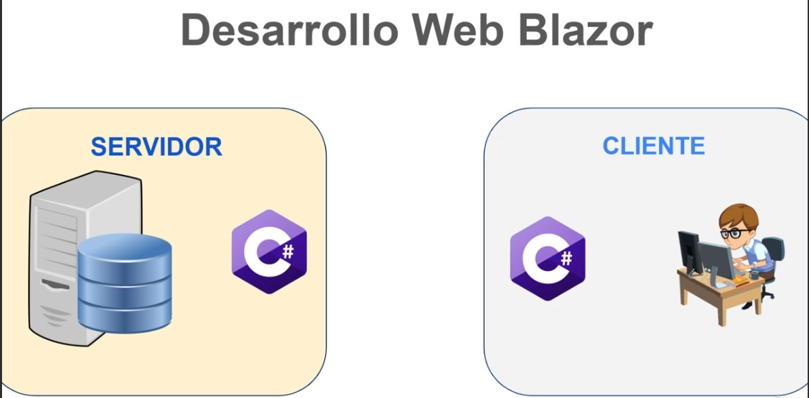
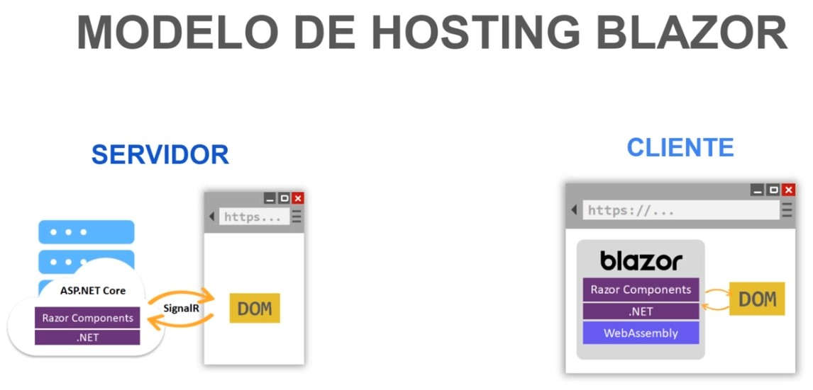

# ASP.NET 8 Web Apis con Blazor y Postgres -Security-SignalR

## ASP.NET Core 8 | Blazor - SignalR con Postgres Oncloud y Firebase Authentication - Store Procedures y Entity Framework

Estos seran algunos temas que veremos:
1. Dar de alta Web Api project con .NET 8
2. Integrar modelo y esquema de seguridad de Firebase en .NET 8
3. Setup de base de datos onCloud Postgres - totalmente gratis!
4. Crear store procedures y functions en Postgres para dar mantenimiento a nuestro modelo de datos
5. Consumir store procedures y functions de Postgres utilizando Entity Framework 8
6. Implementar patron Repository para clases Implementacion e interface de products
7. Creacion de proyecto Blazor webassembly en .NET 8
8. Consumir en Blazor esquemas de modelos de datos de web api NET 8
9. Enviar mensajes y notificaciones entre Web API y Blazor con SignalR
10. Crea tus propias tablas Usuario, Roles y Permisos para dar de alta tu propio modelo de Authorization

y muchos temas mas!!

## Que es Blazor?

Blazor es una plataforma de trabajo para la creación de interfaces de usuario web interactivas del lado cliente con Blazor:
- Cree interfaces de usuario completamente interactivas con C# en lugar de JavaScript.
- Comparta la lógica de aplicación del lado cliente y servidor escrita con .NET.
- Represente la interfaz de usuario como HTML y CSS para la compatibilidad con todos los exploradores, incluidos los móviles.
- Realice la integración con plataformas de hospedaje modernas, como Docker.
- Cree aplicaciones híbridas de escritorio y móviles con .NET y Blazor.

## Principios da Implementacion

